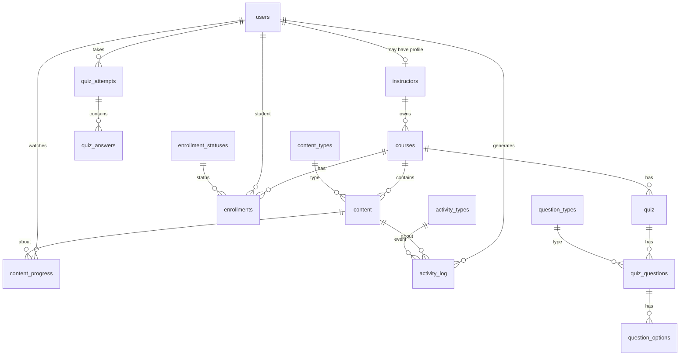

# LearnTrack Database Guide

This document explains the **PostgreSQL / Supabase** schema for the LearnTrack project. Use it to onboard teammates, write reports, or walk through the design in presentations.

**Source of truth:** `backend/src/db/ddl.sql` (schema) and `backend/src/db/seed.sql` (sample data).

---

## 1. Design choices (read this first)

| Choice | What it means |
|--------|----------------|
| **`users.user_id` is a UUID** | Matches Supabase Auth (`auth.users.id`). One global identity for every person. |
| **Most other primary keys are `SERIAL` (integers)** | Courses, content, quizzes, etc. use simple auto-increment IDs. |
| **Single `users` table for all roles** | Students, instructors, and admins are **not** split into separate user tables. The column **`users.role`** is `'student'`, `'instructor'`, or `'admin'`. |
| **`instructors` is an extra profile** | People who teach get **one row in `users`** (login + role) **and** **one row in `instructors`** (teaching profile + link to courses). Students usually have **no** `instructors` row. |
| **Soft delete for users and courses** | `users.deleted_at` and `courses.deleted_at`: `NULL` means active; a timestamp means “hidden” but history can remain. |
| **Backend uses Supabase service role** | The Node API uses the **service role** key so it can read/write all tables. Row Level Security (RLS) in `ddl.sql` is mainly for Supabase-native clients; your coursework can focus on the tables and API. |

---

## 2. Big picture: who lives where?

```
┌─────────────────────────────────────────────────────────────────┐
│                         users (everyone)                         │
│  user_id (UUID), email, password hash, role, profile fields…     │
└───────────────┬─────────────────────────────────┬────────────────┘
                │                                 │
                │ role = student                  │ role = instructor or admin
                │                                 │
                ▼                                 ▼
     ┌──────────────────┐              ┌──────────────────┐
     │  enrollments     │              │   instructors   │
     │  progress, log   │              │   (1 row / user) │
     │  quiz_attempts   │              │   instructor_id  │
     └────────┬─────────┘              └────────┬─────────┘
              │                               │
              │         ┌─────────────────────┘
              │         │
              ▼         ▼
       ┌──────────────────────┐
       │       courses         │  ← owned by instructors.instructor_id
       └──────────┬───────────┘
                  │
      ┌───────────┼───────────┬────────────────┐
      ▼           ▼           ▼                ▼
  content    enrollments     quiz         (analytics MVs)
```

**Takeaway:** There is **one** list of people (`users`). Instructors are **users with role instructor/admin** plus a row in **`instructors`** so **`courses`** can point at **`instructor_id`**.

---

## 3. Entity relationship (conceptual)



---

## 4. Tables by tier

### Tier 1 — Core identity

#### `users`

| Column | Type | Notes |
|--------|------|--------|
| `user_id` | UUID | **Primary key.** Same idea as Supabase `auth.users.id`. |
| `full_name` | VARCHAR(100) | Display name. |
| `email` | VARCHAR(150) | **Unique.** Login identifier. |
| `password` | VARCHAR(255) | Bcrypt hash (app registration path). |
| `role` | VARCHAR(20) | **`student`**, **`instructor`**, or **`admin`**. |
| `bio`, `avatar_url` | Optional profile. |
| `is_active` | BOOLEAN | Account enabled/disabled. |
| `deleted_at` | TIMESTAMPTZ | Soft delete; `NULL` = active user. |
| `created_at`, `updated_at` | Timestamps. |

**Important:** All students, instructors, and admins appear **only** here for “who is this person?” The **`instructors`** table does **not** replace `users`; it **extends** instructors/admins who teach.

---

### Tier 2 — Lookup tables (small reference lists)

These keep labels consistent and use integer IDs foreign-keyed elsewhere.

| Table | Purpose | Example values (from seed) |
|-------|---------|----------------------------|
| `activity_types` | Kind of learning event | `play`, `pause`, `skip`, `seek`, `complete` |
| `content_types` | Kind of syllabus item | `video`, `document`, `quiz` |
| `enrollment_statuses` | Student–course state | `active`, `completed`, `dropped` |
| `question_types` | Quiz question shape | `mcq`, `true_false` |

---

### Tier 3 — Instructor profile

#### `instructors`

| Column | Type | Notes |
|--------|------|--------|
| `instructor_id` | SERIAL | **Primary key** used by **`courses.instructor_id`**. |
| `user_id` | UUID | **Unique** FK → **`users.user_id`**. One profile per user. |
| `department`, `qualification` | Optional CV-style fields. |

**Who fills `department` / `qualification`?**

- They stay **NULL** until someone provides them. Automatic signup only creates a row with `user_id`; it does not invent department text.
- **`seed.sql`** sets them for the demo admin and instructor accounts.
- In the app, **instructors** can enter them at **registration** (optional fields) or anytime on the **Instructor dashboard → Teaching profile**, which calls **`PUT /api/v1/instructors/me`**.
- Course detail pages read these from the nested `instructors` record when showing who teaches a course.

**Triggers / rules (in DDL):**

- **`check_instructor_role`**: You cannot insert/update an `instructors` row unless **`users.role`** is `instructor` or `admin` and the user is not soft-deleted.
- **`ensure_instructor_profile`**: When a user becomes instructor/admin (or is undeleted), a row is **auto-inserted** into `instructors` if missing.

**Why both `users` and `instructors`?**

- **`users`**: authentication and global role.
- **`instructors`**: stable **`instructor_id`** for **`courses`** without overloading `user_id` everywhere in course ownership.

---

### Tier 4 — Courses and content

#### `courses`

| Column | Type | Notes |
|--------|------|--------|
| `course_id` | SERIAL | Primary key. |
| `instructor_id` | INT | FK → **`instructors.instructor_id`** (who owns the course). |
| `title`, `description`, `category` | Course metadata. |
| `thumbnail_url` | Optional image. |
| `is_published` | If false, students typically cannot enroll (app logic). |
| `deleted_at` | Soft delete for the course. |

**API vs “my courses”:** The student-facing **`GET /api/v1/courses`** endpoint lists **everyone’s published** courses (browse / enrol catalogue). Logged-in **instructors** use **`GET /api/v1/courses/mine`** to load only rows where **`instructor_id`** matches their teaching profile — so a new instructor does not see seeded courses belonging to someone else.

#### `enrollments`

Links a **student** (`users.user_id`) to a **`course_id`** with a status.

| Column | Type | Notes |
|--------|------|--------|
| `enrollment_id` | SERIAL | Primary key. |
| `user_id` | UUID | The **student** (or any enrolled user). |
| `course_id` | INT | FK → courses. |
| `status_id` | INT | FK → **`enrollment_statuses`** (default `1` = active in seed). |
| **Constraint** | | **`UNIQUE (user_id, course_id)`** — one enrollment row per user per course. |

#### `content`

Lessons or resources inside a course (videos, documents, etc.).

| Column | Type | Notes |
|--------|------|--------|
| `content_id` | SERIAL | Primary key. |
| `course_id` | INT | FK → courses. |
| `content_type_id` | INT | FK → **`content_types`**. |
| `title` | VARCHAR(200). |
| `content_url`, `content_body` | Optional URL (e.g. video) or text. |
| `duration_sec` | Optional length. |
| `sort_order` | Display order in the syllabus. |
| `is_published` | Whether students see it. |

**Note:** There is also a **`quiz`** table for real quizzes. A `content` row can have type `quiz` in **`content_types`**, but linking that row to a specific **`quiz.quiz_id`** is an application-level concern unless you add a FK later.

---

### Tier 5 — Activity and progress

#### `activity_log`

Granular events while students engage with content.

| Column | Type | Notes |
|--------|------|--------|
| `user_id` | UUID | Who did it. |
| `content_id` | INT | Which content item. |
| `type_id` | INT | FK → **`activity_types`**. |
| `watch_time` | INT | Seconds (e.g. accumulated watch). |
| `event_at` | TIMESTAMPTZ | When it happened. |

Used for analytics (e.g. “active students”, “skipped content”).

#### `content_progress`

One row per **(user, content)** summarizing how far they got.

| Column | Type | Notes |
|--------|------|--------|
| `user_id`, `content_id` | | **Unique pair** — at most one progress row per user per item. |
| `progress_percent` | NUMERIC | 0–100. |
| `last_watched_at` | TIMESTAMPTZ | Last update time. |

---

### Tier 6 — Quiz system

#### `quiz`

A quiz belongs to a **course** (not to a single `content` row unless you mirror that in the app).

| Column | Type | Notes |
|--------|------|--------|
| `quiz_id` | SERIAL | Primary key. |
| `course_id` | INT | FK → courses. |
| `title` | VARCHAR(200). |
| `time_limit_min` | Optional. |
| `pass_score` | NUMERIC | 0–100; pass threshold. |
| `allow_multiple` | BOOLEAN | Multiple attempts allowed or not. |
| `is_published` | BOOLEAN | Whether students see it. |

#### `quiz_questions`

| Column | Type | Notes |
|--------|------|--------|
| `question_id` | SERIAL | Primary key. |
| `quiz_id` | INT | FK → quiz. |
| `question_type_id` | INT | FK → **`question_types`**. |
| `question_text` | TEXT | The prompt. |
| `sort_order`, `points` | Ordering and weight. |

#### `question_options`

| Column | Type | Notes |
|--------|------|--------|
| `option_id` | SERIAL | Primary key. |
| `question_id` | INT | FK → quiz_questions. |
| `option_text` | VARCHAR(500). |
| `is_correct` | BOOLEAN | Grading truth (hidden from students in API responses). |
| `sort_order` | Display order. |

#### `quiz_attempts`

One row per **submission** (per user per attempt).

| Column | Type | Notes |
|--------|------|--------|
| `attempt_id` | SERIAL | Primary key. |
| `user_id` | UUID | Student. |
| `quiz_id` | INT | Which quiz. |
| `score` | NUMERIC | 0–100 (final grade for this attempt). |
| `passed` | BOOLEAN | Compared to `quiz.pass_score`. |
| `attempt_date` | TIMESTAMPTZ | When submitted. |

#### `quiz_answers`

Per-question detail for an attempt.

| Column | Type | Notes |
|--------|------|--------|
| `attempt_id`, `question_id` | | **Unique (attempt_id, question_id)** — one chosen option per question per attempt. |
| `option_id` | INT | What they selected. |
| `is_correct` | BOOLEAN | Denormalized copy for fast reporting (matches option truth at submit time). |

---

### Tier 7 — Sessions

#### `user_sessions`

Tracks login sessions (e.g. token hash, expiry, logout). Used by the backend auth flow for revocation / auditing.

---

## 5. Materialized views (analytics snapshots)

These are **precomputed** query results. They are **not** normalized operational tables; refresh them after bulk loads or on a schedule.

| View | Rough meaning |
|------|----------------|
| `mv_performance_summary` | Per **(user_id, course_id)**: watch time, avg quiz score, avg completion. |
| `mv_active_students` | Students aggregated from **`activity_log`**. |
| `mv_underperforming_students` | Low average quiz scores (global aggregate). |
| `mv_skipped_content` | Content items with many **skip** events. |
| `mv_completion_rates` | Per user/course from **`content_progress`**. |

**Functions:** `refresh_analytics_views()` refreshes all of them; `refresh_performance_summary()` is a wrapper for backward compatibility.

---

## 6. Walkthrough examples (for presentations)

### Example A — New instructor

1. Insert (or register) a row in **`users`** with `role = 'instructor'`.
2. Trigger **`ensure_instructor_profile`** creates **`instructors`** with that `user_id`.
3. Insert **`courses`** with that **`instructor_id`**.
4. Add **`content`** and **`quiz`** rows for that `course_id`.

### Example B — Student takes a course

1. Student exists in **`users`** (`role = 'student'`).
2. **`enrollments`**: new row (`user_id`, `course_id`, `status_id` active).
3. Watching videos updates **`activity_log`** and **`content_progress`**.
4. Taking a quiz: insert **`quiz_attempts`**, then **`quiz_answers`** for each question.

### Example C — Admin

- Admin is a row in **`users`** with `role = 'admin'`.
- Your seed also gives the admin an **`instructors`** row so they can own courses if the app allows it.

---

## 7. Running the schema and seed locally

1. Open Supabase SQL editor (or `psql`).
2. Run **`backend/src/db/ddl.sql`** (defines tables, views, triggers, RLS).
3. Run **`backend/src/db/seed.sql`** (test users, courses, sample progress — uses fixed UUIDs).
4. **Important:** The API logs in with **Supabase Auth** (`signInWithPassword`), not the `public.users.password` column. After seeding, run from **`backend`**:  
   **`npm run seed:auth`**  
   (needs `SUPABASE_URL` + `SUPABASE_SERVICE_ROLE_KEY` in `backend/.env`).  
   Seed login password: **`TestPass123!`**.  
   Details: **`LOGIN_AND_AUTH.md`**.

If you re-run seed on an existing DB, you may hit **duplicate key** errors unless you reset or use `ON CONFLICT` patterns; for coursework, often **drop + ddl + seed** is simplest.

---

## 8. Glossary

| Term | Meaning |
|------|---------|
| **FK** | Foreign key: column values must exist in the referenced table. |
| **UUID** | 128-bit identifier; used for `users.user_id` to align with Supabase Auth. |
| **SERIAL** | Auto-incrementing integer primary key. |
| **Soft delete** | Mark row as deleted (`deleted_at`) instead of removing it. |
| **RLS** | Row Level Security: optional Postgres rules for who can see which rows (your API often bypasses this with the service role). |

---

## 9. File map

| File | Role |
|------|------|
| `backend/src/db/ddl.sql` | Full schema, indexes, triggers, RLS, materialized views, refresh functions. |
| `backend/src/db/seed.sql` | Demo data for development and analytics screenshots. |
| `backend/src/db/connection.js` | Supabase JS client (service role) used by Express. |

---

*Document version: matches LearnTrack v2 UUID schema in `ddl.sql`. Update this guide if you add tables or change keys.*
