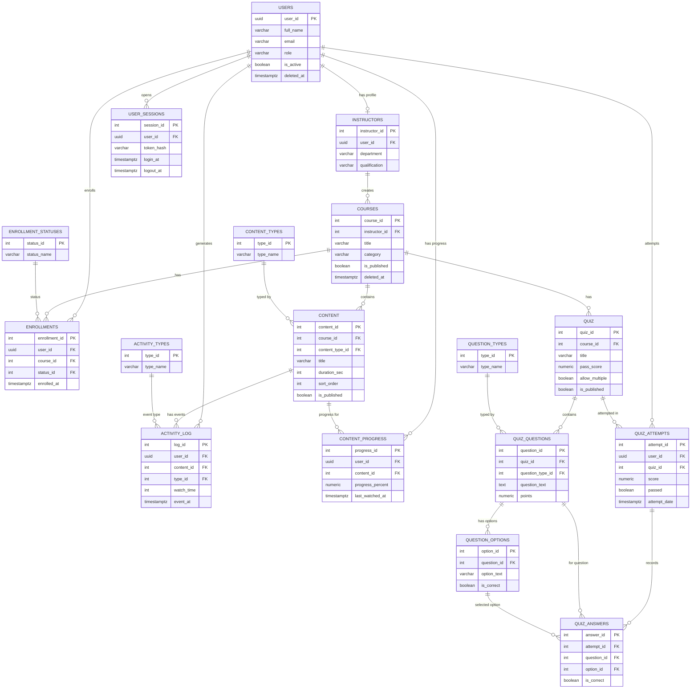
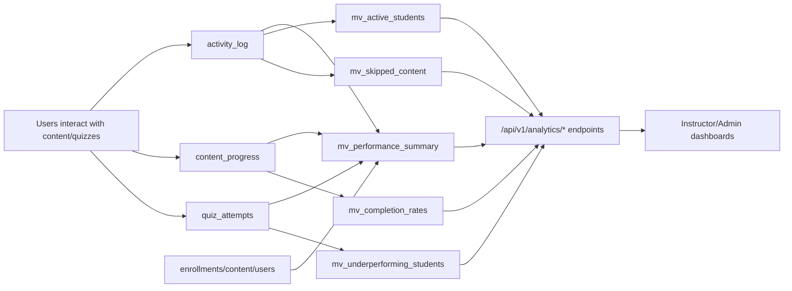

# LearnTrack DBMS Diagrams

Use this file for presentation visuals. It contains:
- ER diagram (tables + relationships)
- Analytics flow diagram

---

## 1) ER Diagram (Core Database)

---

## 2) Analytics Pipeline Diagram

---

## 3) How to Explain the Diagram in Viva

- Core OLTP flow: user, course, enrollment, content, quiz attempt.
- Event data (`activity_log`, `content_progress`, `quiz_attempts`) feeds analytics layer.
- Materialized views precompute expensive joins/aggregates.
- API reads those views for fast instructor/admin dashboards.

